# Get it right

[View the Live Website Here](https://tmarkec.github.io/Get-it-right/)

## Table of Content
1. [Project Goals](#project-goals)
   1. [User Goals](#user-goals)
   2. [Site Owner Goals](#site-owner-goals)
2. [User Experience](#user-experience)
   1. [Target Audience](#target-audience)
   2. [User Requirements and Expectations](#user-requirements-and-expectations)
   3. [User Stories](#user-stories)
   4. [Site Owner Stories](#site-owner-stories)
3. [Design](#design)
   1. [Design Choices](#design-choices)
   2. [Colour](#colours)
   3. [Fonts](#fonts)
   4. [Wireframes](#wireframes)
4. [Technologies Used](#technologies-used)
   1. [Languages](#languages)
   2. [Frameworks & Tools](#frameworks-&-tools)
5. [Features](#features)
   1. [Welcome page](#welcome-page)
   2. [Game page](#game-page)
6. [Testing](#testing)
   1. [HTML Validation](#HTML-validation)
   2. [CSS Validation](#CSS-validation)
   3. [JavaScript Validation](#javascript-validation)
   4. [Performance & Accessibility](#performance--accessibility)
   5. [Device testing](#performing-tests-on-various-devices)
   6. [Browser compatibility](#browser-compatability)
   7. [Testing user stories](#testing-user-stories)
   8. [Other testiog](#other-testing)
7. [Bugs](#Bugs)
8. [Deployment](#deployment)
9. [Credits](#credits)
10. [Acknowledgments](#acknowledgments)

## Project Goals
Creating classic "chance" game in which user is trying to predict random number from 1-25, generated from the computer with limited attempts on the line.

### User Goals

- Play fun game, that requires minumum effort and it's easy to understand and play

### Site Owner Goals

- Creating engaging game that users would want to come back and play again
- Creating user friendly game
- The game should be fully responsive to be able to be played on different screen sizes.

## User Experience

### Target Audience

- Casual gamers
- People who like to play "chance"games
- People looking to test their luck skills

### User Requirements and Expectations

- A simple and friendly use interface
- Quick & easy game to play
- Buttons and functions that work as expected
- Accesabillity and good design on all screen devices

### User Stories

1. As a user, I want to be able to create user name for the game
2. As a user, I want to get alert if my user name is not up to standards
3. As a user, I want to be able to pick the numbers both by clicking the mouse and by using the keyboard
4. As a user, I want to be able to pick only numbers that are in the range of the rules of the game
5. As a user, I want indication if my guesses were higher or lower than the random pick by computer
6. As a user, I want to know when I win or lose game and in both cases that winning or loosing number is clearly displayed on the screen
7. As a user, I want to be able to either play again, or go back and change to previous page and change my name

## Design

### Design Choices

- The game was designed as a two page layout, where first page gives user quick glance on what this game is about with clear rules displayed while second page is where user plays his game with the simple & clear layout of the elements.

### Colour

- The main colours I picked for this project were black and yellow. With combination depends on what page user is curently on.

### Fonts

- For the fonts, I've used 'Shadows Into Light' font which gives whole page little bit dramatic and interesting look.

### Wireframes

Desktop version

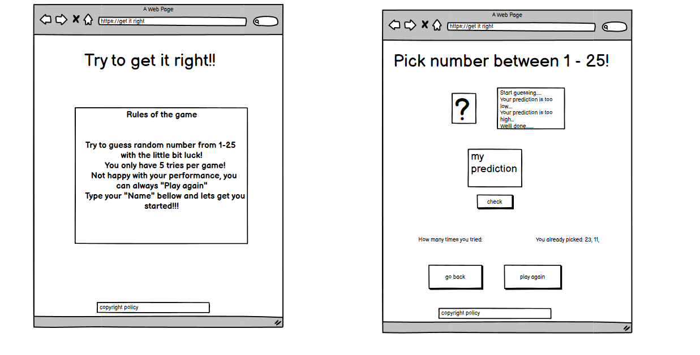

Mobile version

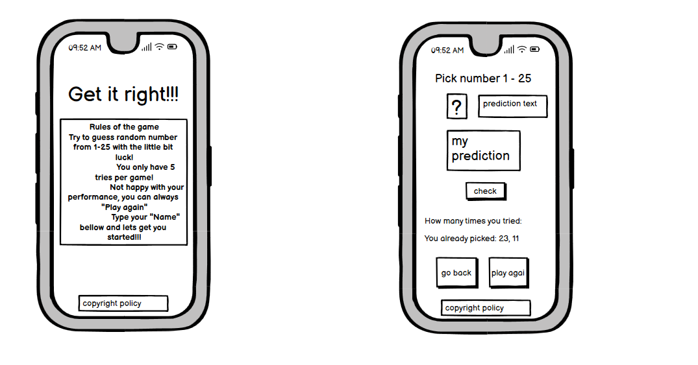

## Technologies Used

### Languages

- HTML
- CSS
- JavaScript

### Frameworks & Tools

- Git
- GitHub
- Gitpod
- Csscript
- SweetAlert
- Balsamiq
- Font Awesome
- Favicon.io
- JSHint
- W3C Markup validation service
- W3C Jigsaw CSS validation service

## Features

The site consists of two pages.

### Welcome page

Welcome page

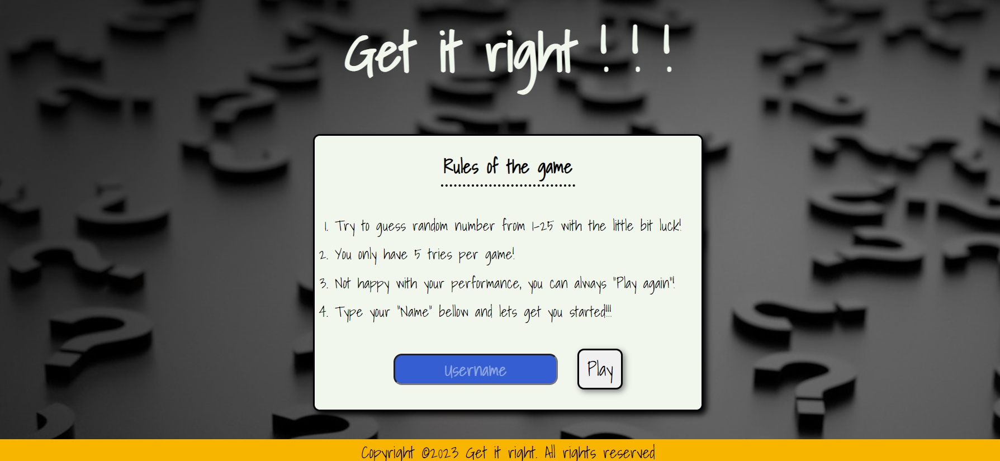

  

Rules

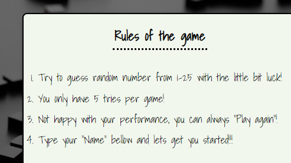

  - Provides user with rules of the game
  

Input field

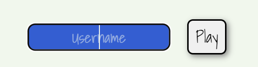

  - Provides user to type his name which will be displayed on the gaming page next to his score with button for user to start to play the game
### Game page

Game page

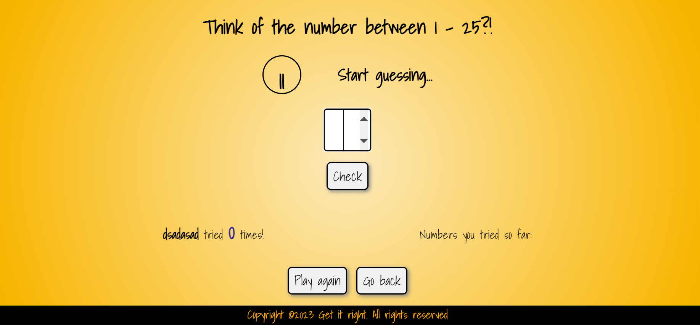

Range of numbers

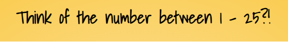

- Clear headline with indication for the range of the guessing numbers

Computer random number with text

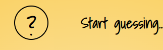

- Question mark is where number will be displayed if user wins/lose the game, with text right next to it which guides user through the game as he plays

User input number

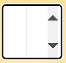

- Input box so user can put his prediction and to check his input with button just bellow it

User info

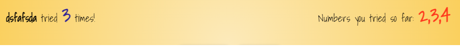

- Clear indication on how many tries user got, and numbers that he already picked

Buttons to play again or to go back 

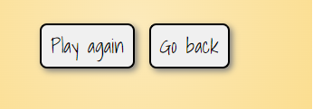

- Button to play again the game and button to go back to previous page if user wish to read rules or change his username

#### Game over screen

Gameover screen

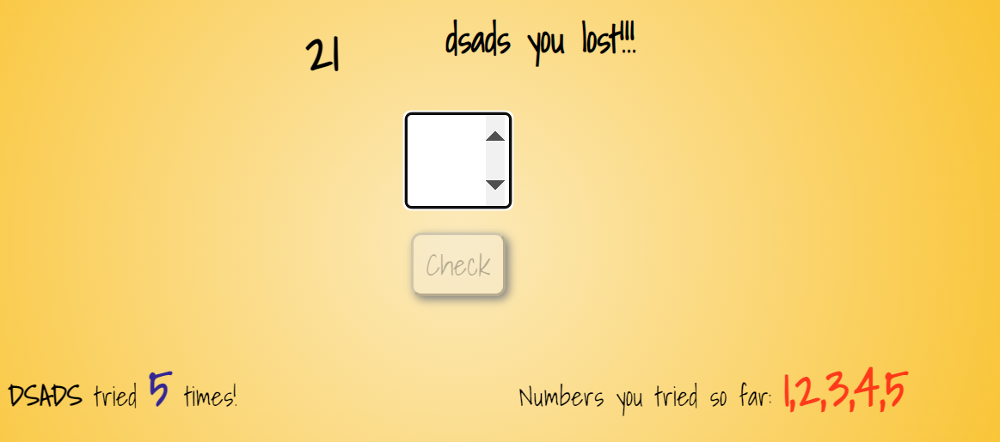

- Gives user clear message that tells him that he lost the game, with the correct number right next to it
- it also desibles "check" button so user can't click again and try the correct number
- also sound button appears on the screen which user can click and get that famous "booo" sound for his performance

#### Correct guess screen

Win screen

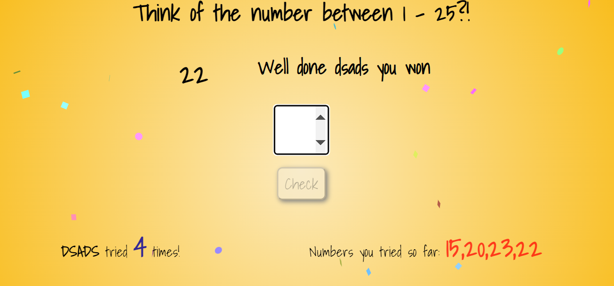

- Gives user clear message that tells him that he won the game, with the correct number right next to it
- it also desibles "check" button so user can't click on it again with different number
- Upon win confetti animation is displayed around input label for user guess

## Testing

### HTML Validation

HTML

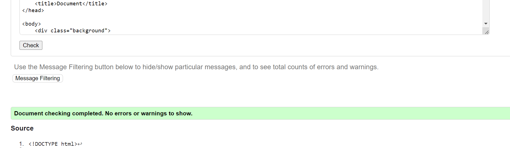

The W3C Markup Validation Service was used to validate the HTML of the website. Page pass with no errors no warnings to show.

### CSS Validation

CSS

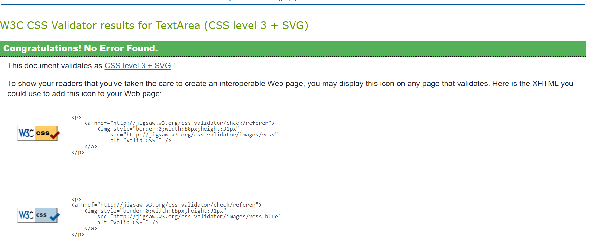

The W3C Jigsaw CSS Validation Service was used to validate the CSS of the website. Page pass with no errors no warnings to show.

### JavaScript Validation

JS

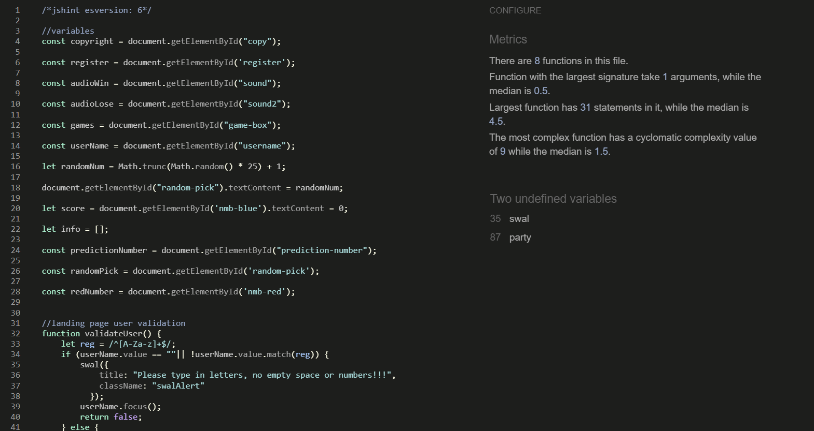

JSHint Static Code Analysis Tool for JavaScript was used to validate the Javascript files. There were 2 undifined variables found in the check(swal & party), both of them are outside libraries which are connected to HTML script code for confetti animation, and for the alert window.

### Performance & Accessibility

Google lighthouse

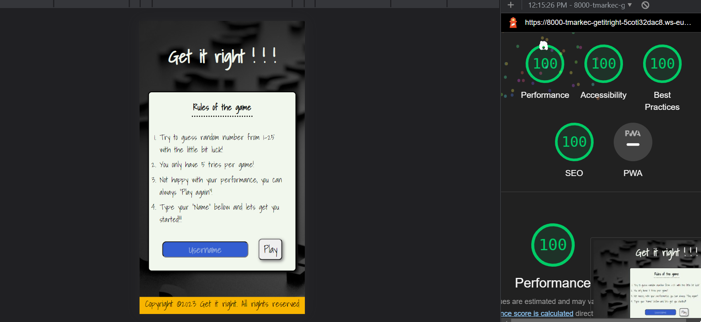

Google Lighthouse in Google Chrome Developer Tools was used to test the performance and accessibility of the website.

### Performing tests on various devices

The website was tested on the following devices:

- Samsung s22
- Iphone 12
- Samsung s10e

In addition, the website was tested using the Google Chrome Developer Tools Device Toggling option for all available device options.

### Browser Compatability

The website was tested on the following browsers:

- Google Chrome
- Mozilla Firefox
- Microsoft Edge

### Testing user stories

1. As a user, I want to be able to create user name for the game

| **Feature**  | **Action**                  | **Expected Result**                                          | **Actual Result** |
| ------------ | --------------------------- | ------------------------------------------------------------ | ----------------- |
| Welcome Page | Click on the username label | On click play button your name should apear in the game page | Works as expected |

Screenshots

2. As a user, I want to get alert if my user name is not up to standards

| **Feature** | **Action**                           | **Expected Result**                                           | **Actual Result** |
| ----------- | ------------------------------------ | ------------------------------------------------------------- | ----------------- |
| Welcome page   | Type either space or number and click "Play" | To check your input and display error message | Works as expected |

Screenshots

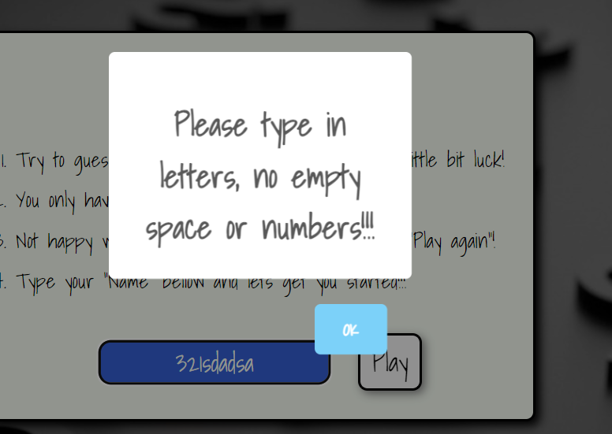

3. As a user, I want to be able to pick the numbers both by clicking the mouse and by using the keyboard

| **Feature** | **Action**                                         | **Expected Result**                            | **Actual Result** |
| ----------- | -------------------------------------------------- | ---------------------------------------------- | ----------------- |
| Game screen | Click the higher on the label or use your keyboard | The used numbers can't be picked a second time | Works as expected |

Screenshots

4. As a user, I want to be able to pick only numbers that are in the range of the rules of the game

| **Feature** | **Action**                                 | **Expected Result**                                                                     | **Actual Result** |
| ----------- | ------------------------------------------ | --------------------------------------------------------------------------------------- | ----------------- |
| Game page   | Pick number higher or lower than the range | Message apears on the screen to show user range of the numbers game is beeing played at | Works as expected |

Screenshots

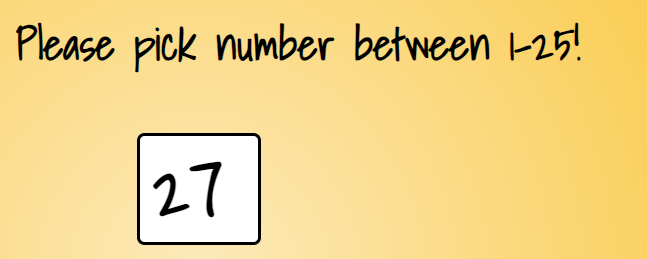

5. As a user, I want indication if my guesses were higher or lower than the random pick

| **Feature** | **Action**                                     | **Expected Result**                                                                | **Actual Result** |
| ----------- | ---------------------------------------------- | ---------------------------------------------------------------------------------- | ----------------- |
| Game page   | Pick number that is not equal to random number | Message apears on the screen which gives user hint if his guess is lower or higher | Works as expected |

Screenshots

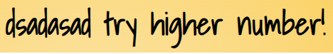

Screenshots

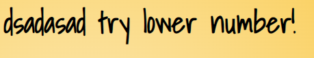

6. As a user, I want to know when I win or lose game and that in both cases random number is displayed on the screen

| **Feature** | **Action**                                            | **Expected Result**                                                                                                                               | **Actual Result** |
| ----------- | ----------------------------------------------------- | ------------------------------------------------------------------------------------------------------------------------------------------------- | ----------------- |
| Game page   | Try random number multiple times till you win or lose | In case of winning message will be desplayed with confetti animation, in case of loosing message will be displayed with option to replicate sound | Works as expected |

Screenshots

Screenshots

7. As a user, I want to be able to either play again, or to start new game with new username

| **Feature** | **Action**                | **Expected Result**                                                  | **Actual Result** |
| ----------- | ------------------------- | -------------------------------------------------------------------- | ----------------- |
| Game page   | Click on either on "Go back" or "Play again" button | User should be taken to "Landing page" so he can create new username, or new game should start for the user | Work as expected  |

Screenshots

### Other testing
I've tested all the buttons to work properly and to lead user where they supposed to and to perform actions that they were meant to. Tested all input fields so that name input field accept only letters with minimum length of 4 caracthers and max 16 caracthers. Tested input number field to accept only numbers above 0, and that enter on keyboard submits name on landing page field and number on the game page.
## Bugs

| **Bug**                                                                                                         | **Fix**                                                                                                                                                       |
| --------------------------------------------------------------------------------------------------------------- | ------------------------------------------------------------------------------------------------------------------------------------------------------------- |
| Could not put button "check" in able position after the game was finished. When you finish game it is disabled! | Created function outside clickevent and called that function inside clickevent, and add propartie .disabled to true/ false depend on the progress of the game |
| Background image did not load on live pages, but localy it did                                                  | Change file path in my html file to ../ and skip assets folder                                                                                                |
| You could have type and chose negative numbers in input field                                                   | Created if else stateman with parametars, and add min value in html file                                                                                      |
| Sound for winning or loosing the game was only replicated on click of the button                                | Created variables outside function which calls html audio element, and placed it inside if else statemants with and added .play() to the variables            |
| Overall score/tries attempt where only displayed after second click                                             | Incrementer score ++ was put in front of if else statemants                                                                                                   |
| The landing page on smaller screen sizes looked small and long                                                  | Increase max-width of the div element for smaller screens                                                                                                     |
| On input field in the game by pressing "Enter" on the keyboard nothing happend.                                 | Instead of targeting "check" button with function, I've targeted input field itself and added function that check user input                                  |
| Standard pop-up alert window!                                                                                   | Used outside library and code from "sweet alert"                                                                                                              |
| 2 undefined variable in jshint | Still present as both variables are used from outside source to implement confetti animation and for alert window which script tags are places in HTML. They do not interfere with game performance.

## Deployment

The website was deployed using GitHub Pages by following these steps:

1. In the GitHub repository navigate to the Settings tab
2. On the left-hand menu select Pages
3. For the source select Branch: master
4. After the webpage refreshes automatically you will ses a ribbon on the top saying: "Your site is published at https://tmarkec.github.io/Get-it-right/

You can fork the repository by following these steps:

1. Go to the GitHub repository
2. Click on Fork button in the upper right hand corner

You can clone the repository by following these steps:

1. Go to the GitHub repository
2. Locate the Code button above the list of files and click it
3. Select if you prefer to clone using HTTPS, SSH, or Github CLI and click the copy button to copy the URL to your clipboard
4. Open Git Bash
5. Change the current working directory to the one where you want the cloned directory
6. Type git clone and paste the URL from the clipboard ($ git clone https://github.com/YOUR-USERNAME/YOUR-REPOSITORY)
   7.Press Enter to create your local clone.

## Credits

- Code & Content
  - I give credits to [Stack overflow](https://www.stackoverflow.com/), [MDN Web Docs](https://developer.mozilla.org/en-US/) & [W3 Schools](https://www.w3schools.com/) for helping me resolve issues with my HTML, CSS & JS while coding through
  - Inspiration for my game came from [codeduck](https://www.youtube.com/@TheCodeDuck) and [brocode](https://www.youtube.com/@BroCodez) youtube channels
  - Credits for validating user on lanidng page goes to [w3resource](https://www.w3resource.com/javascript/form/letters-numbers-field.php)
  - Credits for alert window in the Landing page goes to [SweetAlert](https://sweetalert.js.org/guides/) which code I used and copied to my JS:
  "swal({title: "", className: ""
          });"
- Media
  - Credit for my image for the welcome page goes to [Unsplash](https://unsplash.com/) which I used as a background image 
  - Credit for my image on the game page goes to [Makeusof](https://www.makeuseof.com/css-background-gradients/)which was used as bakground property
  - For my logo I give credit to [App-logo](https://app.logo.com/) for easily generating my idea and automaticly creating logo for my website
  - Credit for my sound effects after finishing the game goes to [Mixkit](https://mixkit.co/)
  - instructions how to create my favicon came from [MDN Web Docs](https://developer.mozilla.org/en-US/)
  - credit for confetti animation after succesfully completing the game goes to [CSS Script](https://www.cssscript.com/confetti-animation-party/) which code I copied in my JS: "party.confetti(element);"
- Acknowledgment
  - Special thank you goes to mentor Jubril Akolade who helped me to finish my project
  - I would like to thank tuttor support from Code Institue for their help, as well as whole Code Institue for giving me opportunity to attend this course and to work on this project
  - I would also like to thank my collegaues for their support especially Dimmie Egberipour, and my friend Dominik Dragicevic
  - Last but not least I would like to thank our coordinator Irene from Code Institute for giving guidance and schedules on daily basis in the classroom
